# Desktop client screenshots

Rendered from the running Qt widgets by `python scripts/ui_screenshots.py` (no mock-ups):
a real `polmon-backend` process with an API token, the unmodified main window, the
`l0-office` example topology and the `office-sweep` scenario. CI regenerates the same
set as the `ui-screenshots` artifact.

- Generated: 2026-09-27 10:30 UTC
- polmon 0.4.1, Qt 6.11.2, PySide6 6.11.2
- Platform: `offscreen` on Linux 6.8.0-138-generic, window 1440×900
- Experiment: `gui-20260927-122956-8bba`
- UI language: `ru`

## local-backend

Self-contained Local backend preset connected on loopback with the persistent L0-only fidelity indicator and an operator-openable process log.

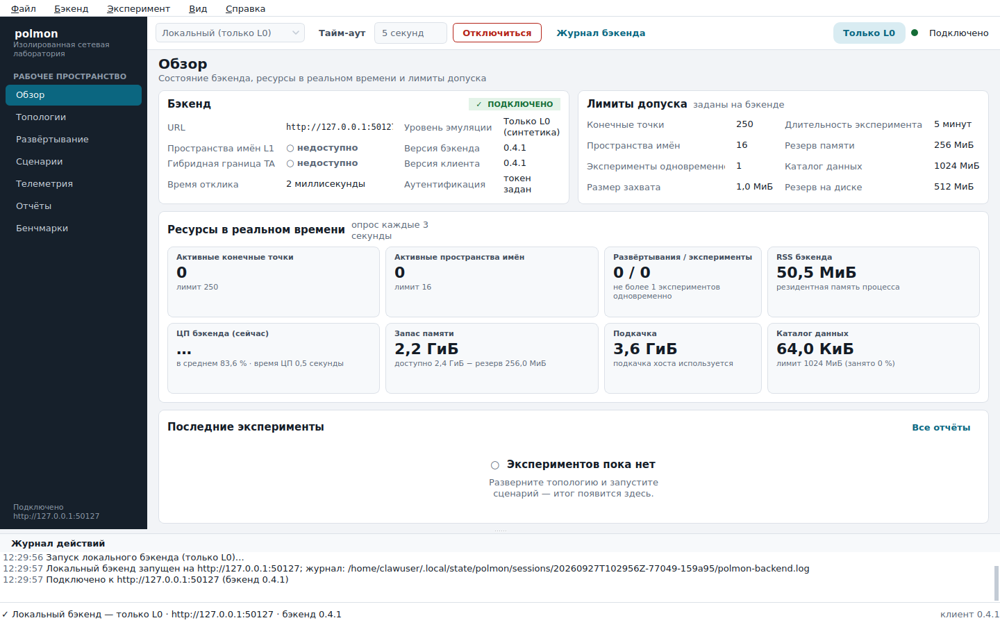

## topologies

Topology editor with backend validation and the node/interface inspector (MAC, IPv4, class).

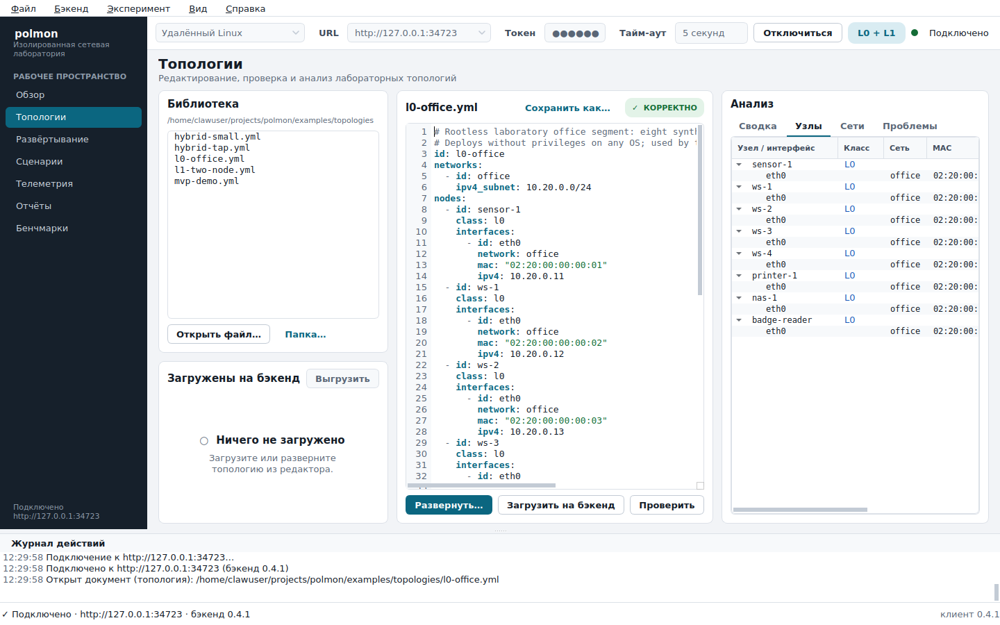

## deployment

Deployment control with owned resources and live resource counters.

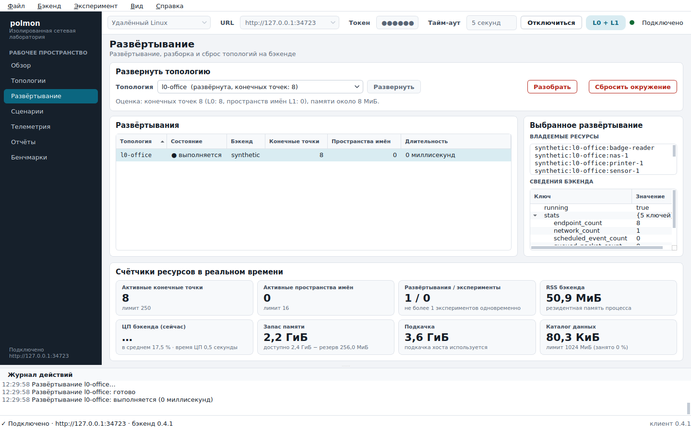

## scenarios

Scenario inspection and a completed experiment with per-action status.

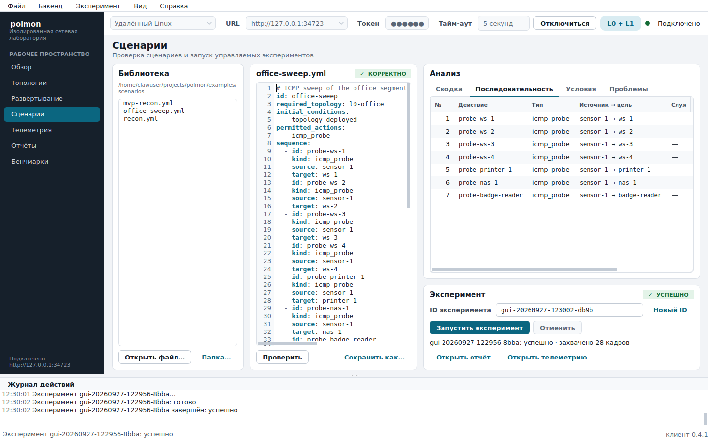

## telemetry

Experiment-scoped telemetry stream with category/text filters, event payload and capture summary.

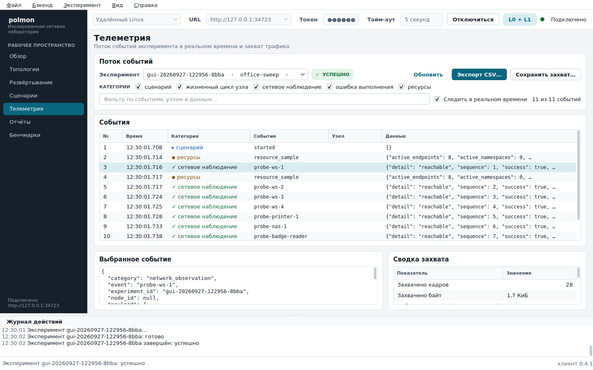

## reports

Report: overall status and expected-versus-actual conditions.

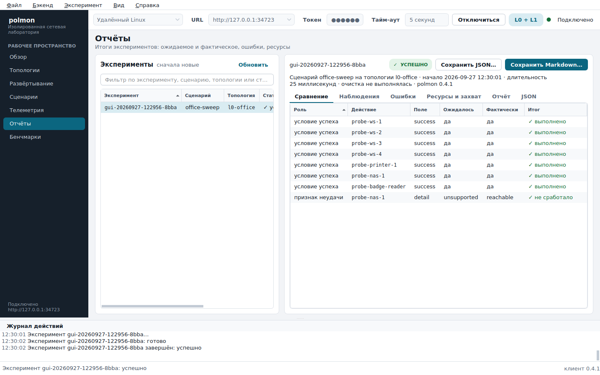

## report-markdown

The human-readable report, rendered by the client from the JSON report in the UI language.

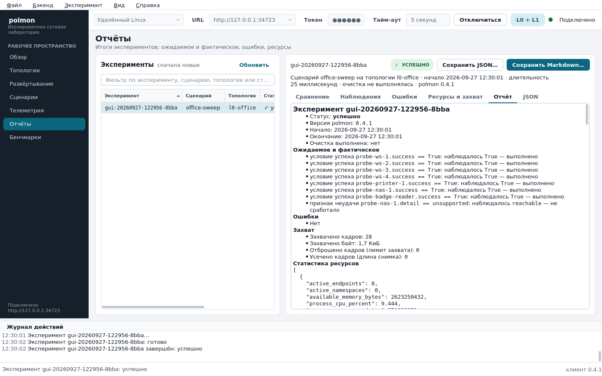

## benchmarks

Bounded benchmark job with explicit limits and a retained result.

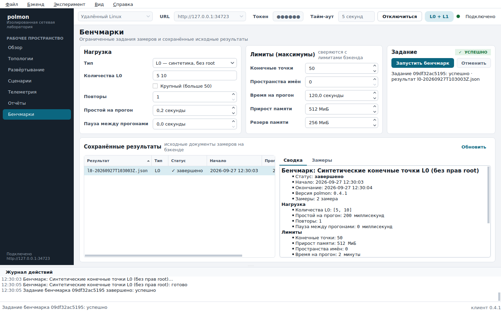

## dashboard

Dashboard: backend identity, live counters with sparklines, admission limits.

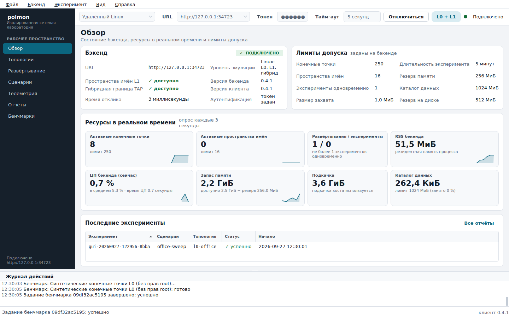

## validation-error

Validation errors mapped to the offending YAML line.

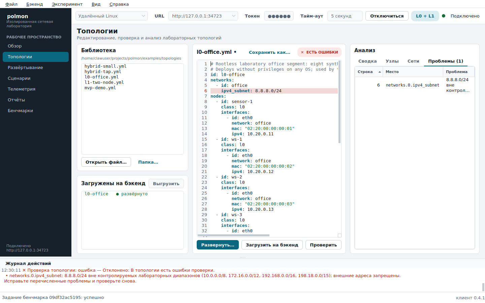

## admission-rejected

Admission control refusing a 300-endpoint deployment, naming the limit that was hit.

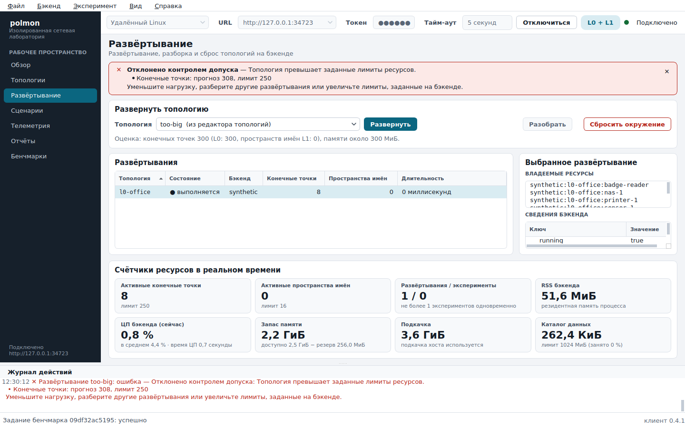

## dashboard-dark

Dark theme: dashboard.

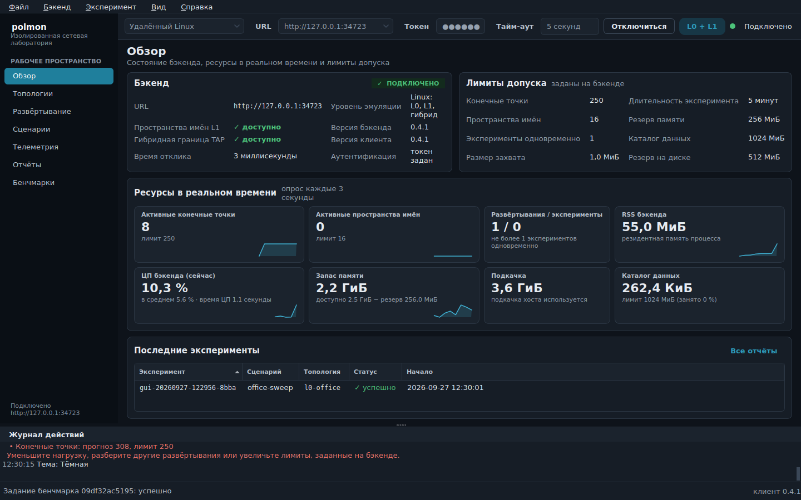

## scenarios-dark

Dark theme: scenarios.

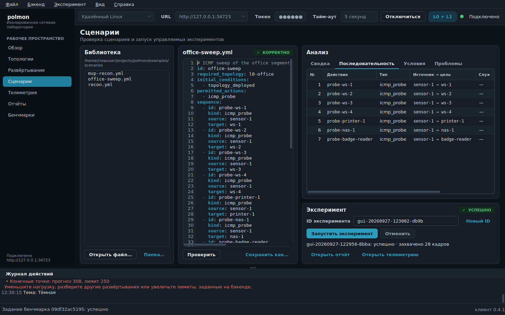

## before-switch-ru

The deployment page in RU just before the runtime language switch.

## language-switch-en

The same window after View → Language → EN at run time: no restart, the connection, the deployment and the page state are unchanged.

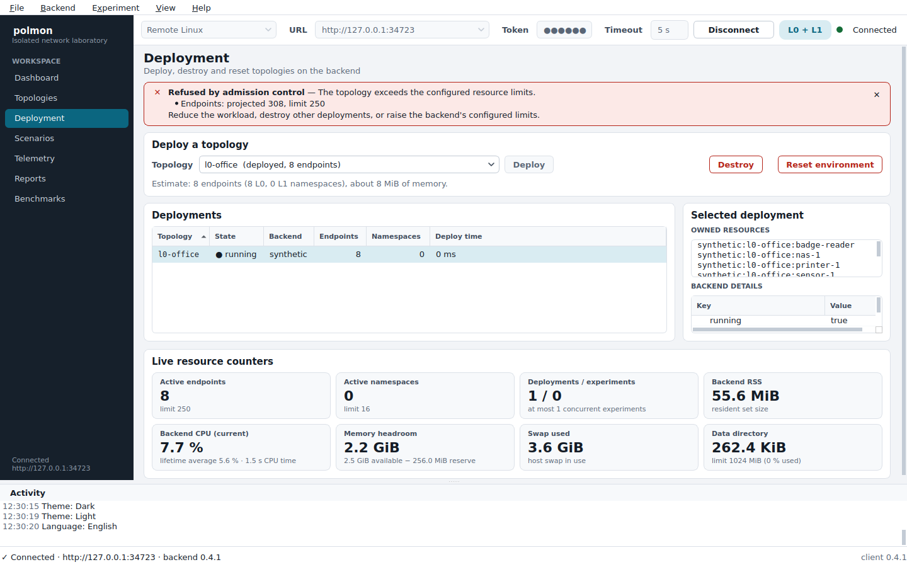
